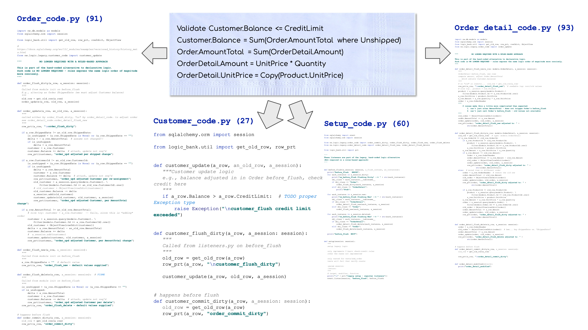
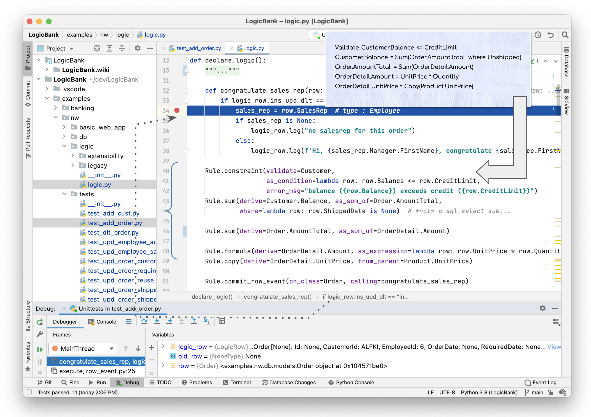
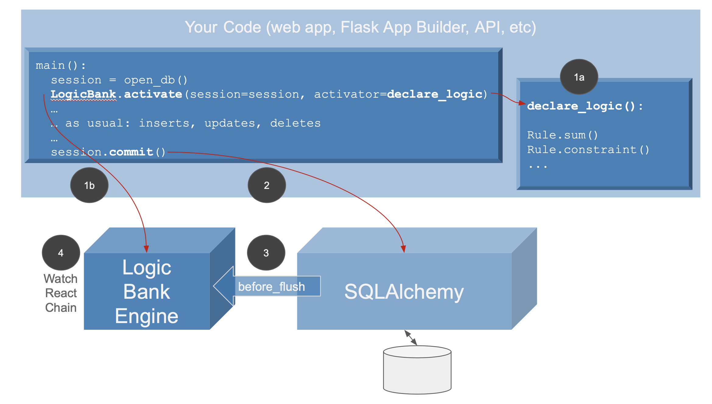
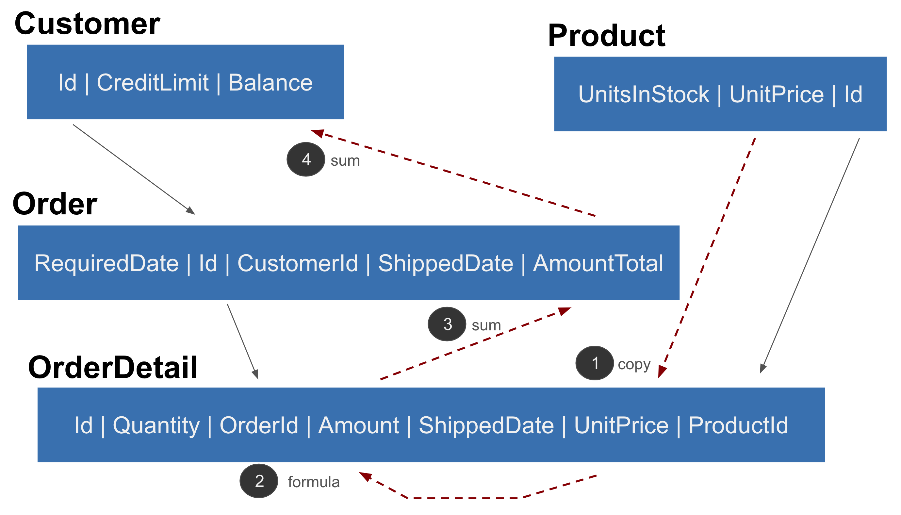
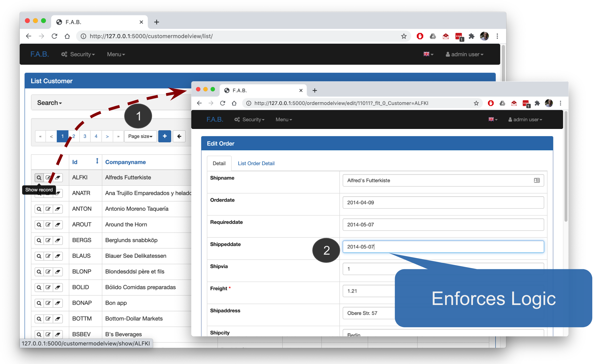

Use Logic Bank to govern SQLAlchemy
update transaction logic - multi-table derivations, constraints,
and actions such as sending mail or messages. Logic consists of both:

* **Rules - 40X** more concise
using a spreadsheet-like paradigm, and

* **Python - control and extensibility,**
using standard tools and techniques


## Why - Simple Cocktail-Napkin Spec Explodes into Massive Legacy Code

If you 've coded backend database logic - multi-table derivations and constraints -
you know how much work it is, and how tedious.  Whether you code it in
triggers and stored procedures, in ORM events, or UI controllers, it's a lot:
typically nearly half the effort for a database project.

It's also incredibly repetitive - you often get the feeling you're doing the same thing over and over.

And you're right.  It's because backend logic follows patterns of "what" is supposed to happen.
And your code is the "how".  Suddenly, a simple cocktail napkin specification explodes into a massive amount of legacy code:

<figure></figure>

Logic Bank was designed to make the cocktail napkin spec _executable_.

## What - Declare Spreadsheet-like Rules - 40X More Concise
Logic Bank introduces rules that are 40X more concise than legacy code.
The 5 rules below (lines 34-43) express the same logic as 200 lines of code [**(see them here)**](nw/logic/legacy).  That's because rules are all about "what"
-- spreadsheet-like expressions that automate the tedious "how":

<figure></figure>

### Standard Python - Declare, Extend, Manage
Logic Bank is fully integrated with Python:
* **Declare** rules in Python as shown above
* **Extend** rules with Python (rule on line 45 invokes the Python function on line 26)
* **Manage** logic using your existing IDE (PyCharm, VSCode etc for code completion, debugging, etc),
and source control tools and procedures

### Technology Evaluation
40X is... _large_ - do these results hold in practice?
See [here](../../wiki#technology-evaluation) for
additional background, and real world experience.


## Architecture - handle SQLAlchemy ```before_flush``` Events
<figure></figure>

Logic Bank operates as shown above:

 1. **Declare** logic as rules and Python (see example above).
 
    - Activate: ``` LogicBank.activate(session=session, activator=declare_logic) ```
    
        > Note: ```declare_logic``` is the function shown above

 2. Your application makes calls on `SQLAlchemy` for inserts, updates and deletes.

    - By bundling transaction logic into SQLAlchemy data access, your logic
  is automatically shared, whether for hand-written code (Flask apps, APIs)
  or via generators such as Flask AppBuilder.

 3. The **Logic Bank** engine handles SQLAlchemy `before_flush` events on
`Mapped Tables`

 4. The logic engine operates much like a spreadsheet:
    - **watch** for changes at the attribute level
    - **react** by running rules that referenced changed attributes, which can
    - **chain** to still other attributes that refer to
_those_ changes.  Note these might be in different tables,
providing automation for _multi-table logic_.

Logic does not apply to updates outside SQLAlchemy,
nor to SQLAlchemy batch updates or unmapped sql updates.

Let's see how logic operates on a typical, multi-table transaction.

#### Logic Execution: Add Order - Watch, React, Chain

<figure></figure>


The `add_order` example illustrates how
__Watch / React / Chain__ operates to
check the Credit Limit as each OrderDetail is inserted:

1.  The `OrderDetail.UnitPrice` (copy, line 43) references Product, so inserts cause it to be copied
    
2.  `Amount` (formula, line 42) watches `UnitPrice`, so its new value recomputes `Amount`
    
3.  `AmountTotal` (sum, line 40) watches `Amount`, so `AmountTotal` is adjusted (more on adjustment, below)
    
4.  `Balance` (sum, line 37) watches `AmountTotal`, so it is adjusted
    
5.  And the Credit Limit constraint (line 34) is checked (exceptions are raised if constraints are violated, and the transaction is rolled back)
    
All of the dependency management to see which attributes have changed,
logic ordering, the SQL commands to read and adjust rows, and the chaining
are fully automated by the engine, based solely on the rules above.

**Reuse over Use Cases is automatic,** so rules designed for _add_ also
automate _deleting_ and _updating_ orders.
This is how 5 rules represent the same logic as 200 lines of code.

Check out more examples:
* [**Ship Order**](../../wiki/Ship-Order) illustrates *cascade*, another form of multi-table logic
* [**Banking**](../../wiki/Sample-Project---Banking) is a complex transaction using the command pattern

#### Scalability: Automatic Prune / Optimize logic
Scalability requires more than clustering - SQLs must be pruned
and optimized.  For example, the balance rule:
* is **pruned** if a non-referenced column is altered (e.g., Shipping Address)
* is **optimized** into a 1-row _adjustment_ update instead of an
expensive SQL aggregate.

For more on how
logic automates and optimizes multi-table transactions,
[click here](../../wiki#scalability-automatic-pruning-and-optimization).


## An Agile Perspective
The core tenant of agile is _working software,_
driving _collaboration,_ for _rapid iterations._
Here's how rules can help.

#### Working Software _Now_
The examples above illustrate how just a few rules can replace 
[pages of code](nw/logic/legacy).

#### Collaboration: Running Screens - Automatic Basic Web App

Certainly business users are more easily able to
read rules than code.  But still, rules are
pretty abstract.

Business users relate best to actual working pages -
_their_ interpretation of working software.
The [fab-quick-start](https://github.com/valhuber/fab-quick-start/wiki)
project enables you to build a basic web app in minutes.

<figure></figure>

This project has already generated such an app, which you can run
once you've finished the Installation process, below.

#### Iteration - Automatic Ordering
Rules are _self-ordering_ - they recognize their interdependencies,
and order their execution and database access (pruning, adjustments etc)
accordingly.  This means:

* order is independent - you can state the rules in any order
and get the same result

* maintenance is simple - just make changes, additions and deletions,
the engine will reorganize execution order and database access, automatically


## Installation
First, follow the instructions to verify / install Python, then install Logic Bank.

### Python Installation

The first section below verifies whether your Python environment is current.
The following section explains how to install a current Python environment.

#### Verify Pre-reqs: Python 3.8, virtualenv, pip3
Ensure you have these pre-reqs:
```
python --version
# requires 3.8 or higher (Relies on `from __future__ import annotations`, so requires Python 3.8)

pip --version
# version 19.2.3 or higher... you might be using pip3

pyenv --version
# 1.2.19 or higher
```
#### Install Python (if required)
If you are missing any, install them as described here.  Skip this step if your pre-reqs are fine.

To install Python:

* Python3.8 

   * Run the windows installer
      * Be sure to specify "add Python to Path"
   * On mac/Unix, consider [using homebrew](https://brew.sh/), as described
[here](https://opensource.com/article/19/5/python-3-default-mac#what-to-do)
   
* virtualenv - see [here](https://www.google.com/url?q=https%3A%2F%2Fpackaging.python.org%2Fguides%2Finstalling-using-pip-and-virtual-environments%2F%23creating-a-virtual-environment&sa=D&sntz=1&usg=AFQjCNEu-ZbYfqRMjNQ0D0DqU1mhFpDYmw)  (e.g.,  `pip install virtualenv`)
   * on PC, see [these instructions](https://pypi.org/project/pyenv-win/)

* An IDE - optional - any will do (I've used [PyCharm](https://www.jetbrains.com/pycharm/download) and [VSCode](https://code.visualstudio.com), install notes [here](https://github.com/valhuber/fab-quick-start/wiki/IDE-Setup)), though different install / generate / run instructions apply for running programs.

Issues?  [Try here](https://github.com/valhuber/fab-quick-start/wiki/Mac-Python-Install-Issues).


### Install LogicBank
In your IDE or Command Line:

```
# optionally fork, and then (WARNING - remove hyphens if you download the zip)
git clone https://github.com/valhuber/LogicBank.git
cd LogicBank
# windows: python -m venv venv
virtualenv venv
# For windows: .\venv\Scripts\activate
source venv/bin/activate
pip install -r requirements.txt
```
> **Warning -** if you just download the zip, *be sure* to remove the hyphen from the name.

> **Warning -** if you use an IDE, be sure to activate the virtual environment, and verify you are running a proper version of Python.

#### Verify and Run

##### Run `basic_web_app`

```
cd LogicBank
cd nw/basic_web_app
# windows set FLASK_APP=app
export FLASK_APP=app
flask run
```
You then start the app (use **new window**) with [`http://127.0.0.1:5000/`]( http://127.0.0.1:5000/)
> **Login** (upper right): user = admin, password = p

You can
1. Navigate to Order 11011 (a _multi-page_ web app)
    * Click **Menu > Customer List** 
    * Click the **magnifying glass** for the first customer
    * Click the **List Order tab**
    * Click the **magnifying glass* for Order **11011**
2. Click Edit so you can make changes
3. Change the Shipped Date
4. Click save
5. Verify logic enforcement
    * The web app has been [configured](../../wiki/Flask-App-Builder-Integration) to activate the rules
    * The logic for this update [is interesting](../../wiki/Ship-Order) -
    check out the console log

##### Run the `nw/tests`
Run the `nw/tests` programs under your IDE or the
command line; start with `add_order` and `upd_order_shipped,`
and see the [walk-throughs here](../../wiki/home#logic-execution-watch-react-chain).

```
cd nw/tests
python add_order.py
```

> Note: the **log** depicts logic execution

#### What's in the project
Logic Bank consists of:

* Three test database systems - `nw,`  `banking` and `payment_allocation`;
these contain

    * [Databases](nw/db) sqlite (no install required)

    * [Test folders](nw/tests) that run key transactions - just run the scripts
(note the logs)

    * [Flask AppBuilder apps](nw/basic_web_app) (as described above)
    
    * [Logic](nw/logic) - models and rules (and for `nw`,
    the manual `legacy` code for contrast to rules)
    
* The `nw` sample illustrates comparisons of Business logic, both
[by code](nw/logic/legacy) and by rules (shown above).

* The `logic_bank` engine source code


#### Status: Running, Under Development
Functionally complete, 9/29/2020, tested for 2 databases.

Incubation - ready to explore and provide feedback
on general value, and features.

#### Acknowledgements
There are many to thank:
* Tyler Band, for testing and the Banking example
* Max Tardiveau, for testing
* Nishanth Shyamsundar, for PC testing
* Michael Holleran, for collaboration
* Mike Bayer, for suggestions on leveraging Python typing
* Gloria, for many reviews... and golden patience

## Articles
There a few articles that provide some orientation to Logic Bank:
* [Automate Business Logic With Logic Bank](https://dzone.com/articles/automate-business-logic-with-logic-bank) - general introduction, discussions of extensibility, manageability and scalability
* [Agile Design Automation With Logic Bank](https://dzone.com/articles/logical-data-indendence) - focuses on automation, design flexibility and agile iterations

## Next Steps

### Explore Sample Transactions

Check out more examples on the [**wiki**](../../wiki) - note the **navigation bar** on the right.  Key samples:
* [**Ship Order**](../../wiki/Ship-Order) illustrates *cascade*, another form of multi-table logic
* [**Allocation**](../../wiki/Sample-Project---Allocation) illustrates *extensibility*,
providing a reusable pattern for a *provider* to allocate
to a set of *recipients*
* [**Banking**](../../wiki/Sample-Project---Banking) is a complex transaction using the command pattern


A good way to proceed is to
* Clear the log
* Run the test
* Review the log, and the rules that drove the processing


#### See also the [LogicBankExamples](https://github.com/valhuber/LogicBankExamples) project

The `Logic Bank Examples` [(setup instructions here)](../../wiki/Sample-Project---Setup)
contains the same examples, but _not_ the `logic_bank` engine source code.
It uses the logic engine via `pip install`, as you would for your own projects:

```
pip install logicbank
```
> This is **not required here**, and requires the same
> pre-reqs noted above

#### Internals

To explore:

* Click [here](../../wiki/Explore-LogicBank)
    for install / operations procedures
    
* Click [here](../../wiki/Logic-Walkthrough) for a
    short overview of internal logic execution

